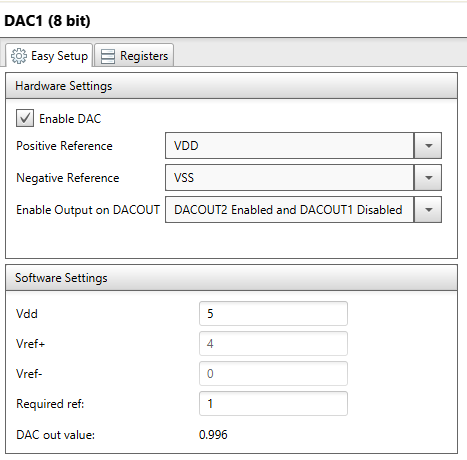
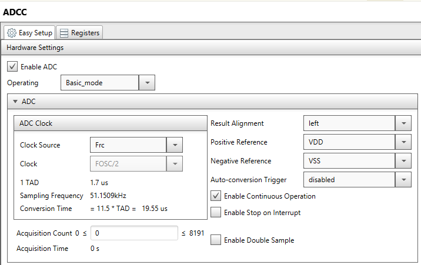
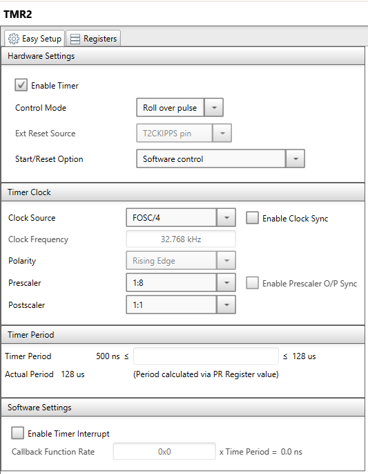
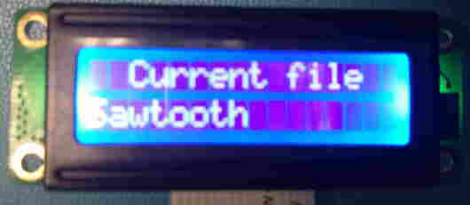
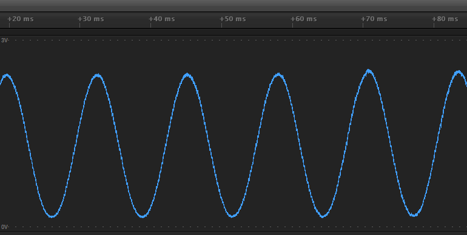

# Related Documentation

This project is related to [AN3312](http://ww1.microchip.com/downloads/en/Appnotes/00003312A.pdf): Arbitrary Waveform Generator Using DAC and DMA. Refer the application note for more details.

# Objective:

This project highlights the use of the PIC18-Q43 family's new 8 bit buffered DAC and the DMA module to generate arbitary waveforms. The waveforms that are generated are up to 255 samples long and are stored on an SD card.
The application reads the data from the SD card and creates a look up table in the RAM space. The DMA module then takes control and loads values into the DAC at an interval governed by a timer.

# Demo Configuration

The High Pin-count Curiosity Board [DM164136](https://www.microchip.com/Developmenttools/ProductDetails/DM164136) is used to house the PIC18F47Q43 device and the two MikroElektronika Click board slots are used to house the LCD click in slot 2 and the SD card click in slot 1. The waveform is output on pin RA2.


# Software Configuration

This project was developed in the MPLABX IDE with the help of MPLAB Code Configurator (MCC) plug-in tool. The user can reconfigure the peripherals using the graphical use interface to match the application. MCC will then generate drivers which the user can use in their application.

### DAC Configuration


```c
void DAC1_Initialize(void)
{
    // OE DACOUT2 Enabled and DACOUT1 Disabled; DAC1EN enabled; NSS VSS; PSS VDD;
    DAC1CON = 0x90;
}
```

### ADCC Configuration


```c
void ADCC_Initialize(void)
{
    ADLTHL = 0x00;      // Lower threshold is 0
    ADLTHH = 0x00;
    ADUTHL = 0x00;      // Upper thershold is 0
    ADUTHH = 0x00;
    ADSTPTL = 0x00;     // Set point is 0
    ADSTPTH = 0x00;
    ADACCU = 0x00;      // Clearing accumulator
    ADRPT = 0x00;       // Repeat = 0
    ADPCH = 0x00;       // Select RA0 as analog input
    ADACQL = 0x00;
    ADACQH = 0x00;
    ADPREL = 0x00;
    ADPREH = 0x00;
    ADCON1 = 0x00;      // ADDSEN disabled; ADGPOL digital_low; ADIPEN disabled; ADPPOL Vss;       
    ADCON2 = 0x00;      // ADCRS 0; ADMD Basic_mode; ADACLR disabled; ADPSIS RES;
    ADCON3 = 0x00;      // ADCALC First derivative of Single measurement; ADTMD disabled; ADSOI ADGO not cleared;
    ADSTAT = 0x00;      // ADMATH registers not updated;
    ADREF = 0x00;       // ADNREF VSS; ADPREF VDD;
    ADACT = 0x00;       // ADACT disabled;
    ADCLK = 0x00;       // ADCS FOSC/2;
    ADCON0 = 0xD0;      // ADGO stop; ADFM left; ADON enabled; ADCS Frc; ADCONT enabled;
}
```

### SPI Configuration


### TMR2 Configuration


```c
void TMR2_Initialize(void)
{
    T2CLKCON = 0x01;     //Clock source = Fosc
    T2HLT = 0x00;        // T2PSYNC Not Synchronized; T2MODE Software control; T2CKPOL Rising Edge; T2CKSYNC Not Synchronized;
    T2HLTbits.PSYNC = 1; // Synchronized
    T2RST = 0x00;        // T2RSEL T2CKIPPS pin;
    T2PR = 0xFF;         // PR2 255;
    T2TMR = 0x00;        // TMR2 0;    
    PIR3bits.TMR2IF = 0; // Clearing IF flag.
    T2CON = 0xB0;        // T2CKPS 1:8; T2OUTPS 1:1; TMR2ON on;
}
```

# Results

Using the two push buttons on pins RC5 and RB4, different waveforms stored in the SD card can be loaded to the DMA look up table and then observed on the DAC output.




  

# Conclusion

This project showcases how the core independent peripherals on the new PIC18-Q43 can be used to create an arbitarty waveform generator. This project highlights the use of DMA module to move data from memory to a peripheral without any CPU intervention.
